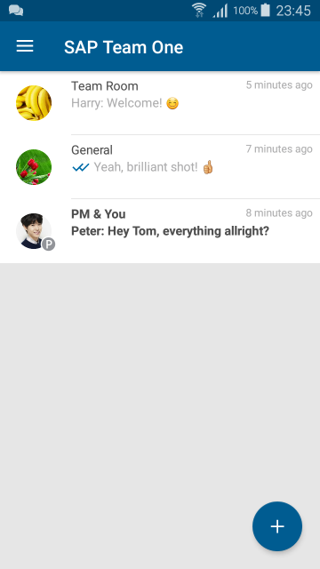

# Open Team One Server

Open Team One Server is a backend component to support the communication
function of SAP Team One mobile apps.

At this point in time the software is work in progress. Further documentation
will be added.

## Screenshots

Here are a few screenshots of SAP Team One connected against Open Team One Server,
displaying the default demo content.

