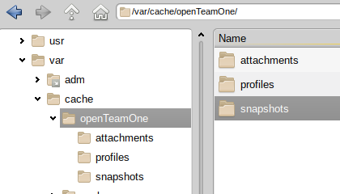
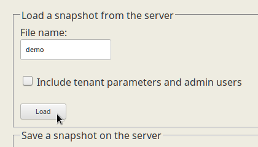
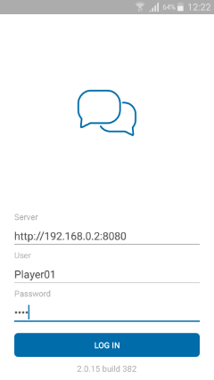
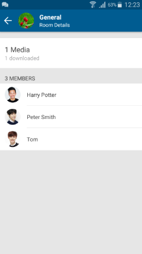

# Open Team One Server

Open Team One Server is a backend component to support the communication function of SAP Team One mobile apps. At this point in time the software is ready to be used productively.

## Scope

Open Team One Server aimes to provide a simple and functional solution of high performance for those needing a communication server under their own control - in terms of source code and operations. Instead of re-inventing the wheel we use freely available mobile clients, namely the SAP Team One mobile apps that are available for multiple platforms.

The SAP Team One apps are normally operated against a SAP Sports One backend that integrates communication with multiple sports applications. Typical examples are injury notifications, videos, questionnaires to capture user feedback and performance KPIs, and information packages combining media and editorials. All those integration scenarios are missing from Open Team One for the simple reason that Open Team One is a best-of-breed communication hub for mobile users, not a sports solution.

One function that cannot be provided for legal reasons are push notifications. The delivery of push notifications would require to reverse-engineer a secret API key.

## Limitations

Whilst the server is functionally complete within the scope described above, the user experience of the web apps for server administration and user self-service is still limited. Those web apps need a better user interaction & web design and a modern implementation resulting in a pleasant best-of-breed user experience.

## Quick Guide (How to run the server with demo content)

A running server instance consists of two data sources: the integrated relational database for structured objects, and the file system for potentially large images and file attachments. The structured objects in the database are sometimes referred to as "business objects". They can be exported and imported in a serialized JSON representation (but internally they strictly live as strongly typed Java objects). The entirety of the database can be exported and imported in the form of large JSON files, which can also be stored in the file system of the server.

Therefore, in order to bootstrap a demo server we need to provide a filesystem directory with content, including a JSON serialization of the database content. We then import the JSON file into the database, and voilà, the demo instance is ready.

### Step 1: Preparation

In step 1 you need to designate a data directory for the server, or rather, for the tenant that this server instance represents. In this example the directory chosen is /var/cache/openTeamOne but you are free to choose any other directory.

You copy the complete content of the project directory "demo" into the designated data directory. At the time of writing that would be the three subdirectories "attachments", "profiles" and "snapshots". The result should look like this:

### Step 2: Starting the Server

Next step is to start the server and log in to the admin section. Since this project is distributed as source code, you would import it as Java project into a suitable IDE like IntelliJ IDEA or Eclipse. When asked for a project type you would probably choose "Maven" to take advantage of the provided _pom.xml_ file.

You would start the server by hitting the "execute" button of your IDE. Alternatively you can build and execute a JAR file on the command line, as layed out in a section below.

### Step 3: Login

When the server is running you call up the start page in a web browser. Assuming your server listens on TCP port 8080 (depends on your run configuration), you would enter the URL http://localhost:8080 in your browser.

The default administration login is user "admin" with password "admin".

### Step 4: Configuration

The server is smart enough to configure missing information when it starts up. There are not many configuration settings to begin with, and every setting can be changed by the administrator. However, there is one setting the server cannot guess: the data directory you have chosen in step 1.

So before you continue with anything, you need to make this directory known to the server. This is done by providing the tenant parameter "dataDirectory" and hitting the "Set" button, as shown in the following picture:

### Step 5: Import

In this step you import the database content of the demo instance from the JSON file "demo". If you followed the previous steps, the server will find it when you hit the "Load" button as in the following picture:

Congratulations! The demo instance is now operational.

### Step 6: Profit

The demo instance contains 3 users that you can log in as from your mobile devices. The user names are player01, player02 and player03. All 3 of them have the case-sensitive password "pass".

You can now familiarize yourself with the system by creating transactional content through mobile devices, and studying the database content using the admin functionality of the server. 

At this point in time the admin functionality is limited to the bare essentials. There are maintenance modules for the database tables available, allowing you to create, read, update & delete table entries (the so-called CRUD operations). There are database tables for tenant parameters, users, persons, rooms, room memberships, messages, files, viewed confirmations and subscriptions.

You can also export and import JSON snapshots of the database content. Note that a JSON file can be partial. For instance, if a JSON import contains only users and persons, it will not affect other object types in the database.

## Screenshots of Demo Content

Here are a few screenshots of SAP Team One connected against Open Team One Server, displaying the default demo content. The screenshots show the drawer, the landing page, the content of a room, the room details.

## Persistence via MariaDB

For a first trial it is quite convenient to use the H2 in-memory database as it comes with Spring Boot and requires no configuration. After your first steps with Open Team One you might want to progress to a disk based SQL database, like MariaDB. MariaDB is a popular MySQL fork. In fact, MariaDB is the continuation of MySQL by the original author and a community. MariaDB is drop-in compatible with MySQL, so everything written in this section works for MySQL, too.

When I first tried integrating with MariaDB, it seemed to be easy. However, I soon ran into issues related to character encoding. The same happened when I set up an instance running on a virtual server on the internet. It seems that we are already hitting the limits of MySQL and MariaDB with an application like Open Team One in an internationalized (non-English) environment. Sorry folks, the days of the empire are over, and Unicode is required these days. The good news is, with the following recipe I managed to get Open Team One to run on a MariaDB database.

First, make sure you have enabled UTF-8 with support for 4-byte characters. To that end, make sure the following configuration is in the MariaDB configuration files. On Debian you do not need to do anything. On Slackware you need to modify _/etc/my.cnf.d/server.cnf_. On other distros it will be similar.

	[mysqld]
	character_set_server = utf8mb4
	collation_server = utf8mb4_unicode_ci

Next you need to prepare an empty database for a standard user. Having started the database daemon, you simply enter the following three commands in any SQL console connected to the database, for instance the _mysql_ binary:

	mysql --password
	> create database teamone character set = 'utf8mb4' collate = 'utf8mb4_unicode_ci';
	> create user 'springuser'@'localhost' identified by 'dbPassword';
	> grant select, insert, update, delete on teamone.* to 'springuser'@'localhost';

In this example the database is called _teamone_ and contains a user _springuser_ with password _dbPassword_. The database name, the user name and the password can be freely chosen.

Now comes the tricky part. Since on the hosted system I ran into problems with key lengths and UTF-8, I could not use the SpringBoot framework to create the database tables automatically (which it normally will do). Instead I had to create the tables offline. You can do the same by simply pasting the provided [script](docu/create_tables_mysql) into the SQL console at this point. If you would like to experiment with SpringBoot instead, you need to elevate the user privileges by saying

	> grant all to 'springuser'@'localhost';

In the latter case, remember to lower the user privileges in a productive environment after table creation.

Next you need to add the JDBC database driver to the project. We have already added the following dependency to our Maven file pom.xml:

	<dependency>
		<groupId>mysql</groupId>
		<artifactId>mysql-connector-java</artifactId>
	</dependency>

So, for MariaDB or MySQL you don't need to do anything. If you use a different SQL database, you'll have to add the corresponding driver.

Finally we add the following properties to the _application.properties_ file. In fact, you just need to uncomment them and insert the correct names and passwords, and maybe the TCP port of the database server.

	spring.jpa.hibernate.ddl-auto=update
	spring.datasource.driver-class-name=com.mysql.jdbc.Driver
	spring.datasource.url=jdbc:mysql://localhost:3306/teamone
	spring.datasource.username=springuser
	spring.datasource.password=dbPassword
	spring.datasource.connectionProperties=useUnicode=true;characterEncoding=utf-8;

Restart Open Team One Server and you're done. If you want to migrate the content over to the new DB, save and import a snapshot via the admin tools. 

## Server Deployment

There is a number of options for the deployment of Spring Boot applications. Read about them in the blog article [Deploying Spring Boot Applications](https://spring.io/blog/2014/03/07/deploying-spring-boot-applications).

One of the most simple deployment option is to build a JAR file that can be executed anywhere. You simply call the Maven wrapper in the project root directory like this:

	$ ./mvnw package

This will build the project in the "target" directory and create two JAR files: One relatively small, containing only the project artefacts, the other one quite large, containing everything including the dependencies.

	-rw-r--r--  1 xxx users 30102998 Nov  9 00:53 openTeamOneServer-0.0.1-SNAPSHOT.jar
	-rw-r--r--  1 xxx users   114474 Nov  9 00:53 openTeamOneServer-0.0.1-SNAPSHOT.jar.original

The large JAR file can be copied to another machine and executed by a JRE (Java Runtime Environment) like this:

	java -jar openTeamOneServer-0.0.1-SNAPSHOT.jar

I was able to run and deploy the jar file on a virtual server on the internet. The server came with a minimal headless Debian 9.0 installation (around 500 MB). I only had to install the following two packages including their dependencies in an ssh console:

	apt-get update
	apt-get install mariadb-server
	apt-get install openjdk-8-jre-headless

Afterwards the system took up 1.2 GB on disk. The system used up 600 MB in RAM for the demo content. CPU load was not measurable under demo conditions. At this stage there is no experience how the server scales under heavy load.

## SSL Configuration

Sadly SSL configuration in Java is not as easy as it could be. However, Spring Boot offers a fairly easy approach if your requirements are simple. For more advanced requirements you are welcome to search the internet. The guide I found most helpful for the setup is [DZone: Spring Boot Secured By Let's Encrypt ](https://dzone.com/articles/spring-boot-secured-by-lets-encrypt).

First of all you need a certificate confirming your domain. For test purposes you can sign your own certificate using the java helper called _keytool_. For productive use, however, you need a certificate signed by a CA (Certificate Authority) that is trusted by major web browsers. Some CAs charge money. However, there are free alternatives, like [Let's Encrypt](https://letsencrypt.org/getting-started/). Following the guide about [Debian](https://certbot.eff.org/#debianstretch-other) I basically did this:

	apt-get install certbot
	certbot certonly --standalone -d <your domain>

This will generate a bunch of keys and certificates in _/etc/letsencrypt/_. Next you need to convert those files into a keystore that Tomcat (the web server embedded in the Spring Boot JAR file) actually understands:

	cd /etc/letsencrypt/live/<your domain>/
	openssl pkcs12 -export -in fullchain.pem -inkey privkey.pem -out keystore.p12 -name <your alias> -CAfile chain.pem -caname root

You will be asked to set a password. Finally, you enter your details in the _application.properties_ file:

	server.port=8443
	security.require-ssl=true
	server.ssl.key-store=/path/to/keystore.p12
	server.ssl.key-store-password=yourKeyStorePassword
	server.ssl.keyStoreType=PKCS12
	server.ssl.keyAlias=yourAlias

After restarting the server you can access it via HTTPS. If you need both HTTP and HTTPS access at the same time, configuration is a little harder. Check out the web tutorials for that.

## Web Application

Open Team One offers a web application for two user groups: administrators and users. There is a unified logon that is accessed by calling up server root, for instance http://localhost:8080 for a local installation.

Users will be taken to a self-service, where they can change their profile picture, display name and password.

Administrators will be taken to a set of pages where they can browse and modify all tables and file attachments in the database. You have caught a glimpse of it in the quick guide section above.

Open Team One is designed to support different web applications, should there ever be more than one. The default web applikation is meant to be a fully functional proof-of-concept. It resides in the project directory src/main/resources/static/default/ and is served via the URL http://localhost:8080/default/ . Additional web applications can be placed into subdirectories that are sibling to src/main/resources/static/default/.

The server offers the following tenant parameters to control the navigation. The /ui/* services will automatically redirect to the targets specified by those tenant parameters. By overwriting them in the database you can set another web application as default.

| Tenant Parameter | Default value             | Usage                                      |
|------------------|---------------------------|--------------------------------------------|
| startPageNoLogon | /default/index.html       | when called without valid session context  |
| startPageLogon   | /default/index.html       | for logins that are neither admin nor user |
| startPageAdmin   | /default/admin/index.html | for logged-in administrators               |
| startPageUser    | /default/user/index.html  | for logged-in users                        |

