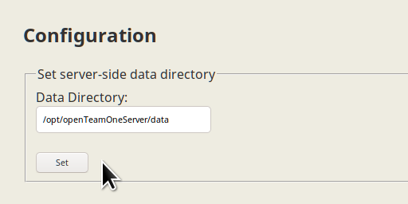

# Open Team One Server

Open Team One Server is a backend component to support the communication function of SAP Team One mobile apps. At this point in time the software is ready to be used productively.

## Quick Guide for the Impatient

Create two environment variables LOCAL_MARIADB_DATA_DIRECTORY and LOCAL_OPEN_TEAM_ONE_DIRECTORY pointing to two empty directories. Next, from inside the `docker` directory, call

	docker-compose up -d

After a few seconds (a minute at most), a fully persisted Team One backend will be available under the URL http://localhost:8080.

Note: for this recipe to work you need to have docker and docker-compose installed.

## Scope

Open Team One Server aimes to provide a simple and functional solution of high performance for those needing a communication server under their own control - in terms of source code and operations. Instead of re-inventing the wheel we use freely available mobile clients, namely the SAP Team One mobile apps that are available for multiple platforms.

The SAP Team One apps are normally operated against a SAP Sports One backend that integrates communication with multiple sports applications. Typical examples are injury notifications, videos, questionnaires to capture user feedback and performance KPIs, and information packages combining media and editorials. All those integration scenarios are missing from Open Team One for the simple reason that Open Team One is purely a communication hub for mobile users, not a sports solution.

An interface for the generation of push notifications has been provided. However, since the API keys and certificates used for the proprietary SAP app are not in the public domain, they cannot be provided as part of this open source project.

## Web Designers Wanted

Whilst the server is functionally complete within the scope described above, the user experience of the web apps for server administration and user self-service is still experimental. Those web apps are fully functional, but they could do with a better web design and a modern frontend implementation resulting in a best-of-breed user experience.

## Starting a Demo Server

A running server instance consists of two data sources: the integrated relational database for structured objects, and the file system for potentially large images and file attachments. The structured objects in the database are sometimes referred to as "business objects". They can be exported and imported in a serialized JSON representation (but internally they strictly exist as strongly typed Java objects). The entirety of the database can be exported and imported in the form of large JSON files, which can also be stored in the file system of the server.

Therefore, in order to bootstrap a demo server we need to provide a filesystem directory with content, including a JSON serialization of the database content. We then import the JSON file into the database, and voilà, the demo instance is ready.

### Step 1: Demo Preparation

In step 1 you need to designate a data directory for the server. You are free to choose any directory you like, but for reasons of analogy with the Docker image we highly suggest using `/opt/openTeamOneServer/data`.

You copy the complete content of the project directory "demo" into the designated data directory. At the time of writing that would be the three subdirectories "attachments", "profiles" and "snapshots". The result should look like this:

### Step 2: Starting the Server

Next step is to start the server and log in to the admin section. There are three Options:

1. If you have Docker installed, simply call up `docker run -v /opt/openTeamOneServer:/opt/openTeamOneServer dockahdockah/openteamone`, provided you followed our naming suggestion in step 1.

2. Otherwise you can run the project from source. Simply import it as Java project into a suitable IDE like IntelliJ IDEA, Net Beans or Eclipse. When asked for a project type you would probably choose "Maven" to take advantage of the provided _pom.xml_ file. When ready, hit the "execute" button of your IDE.

3. Another way of running the project from source is building and executing it from the command line, as layed out in a section below.

### Step 3: Login

When the server is running you call up the start page in a web browser. Assuming your server listens on TCP port 8080, you would enter the URL http://localhost:8080 in your browser.

The default administration login is user "admin" with password "admin".

### Step 4: Configuration

The server is smart enough to configure missing information when it starts up. There are not many configuration settings to begin with, and every setting can be changed by the administrator. However, there is one setting the server cannot guess: the data directory you have chosen in step 1.

So unless you followed our naming suggestion in step 1, you now need to enter your directory name and hit the "Set" button, as shown in the following picture:

### Step 5: Import

In this step you import the database content of the demo instance from the JSON file "demo". If you followed the previous steps, the server will find it when you hit the "Load" button as in the following picture:

Congratulations! The demo instance is now operational.

### Step 6: Profit

The demo instance contains 3 users that you can log in as from your mobile devices. The user names are player01, player02 and player03. All 3 of them have the case-sensitive password "pass".

## Screenshots of Demo Content

Here are a few screenshots of SAP Team One connected against Open Team One Server, displaying the default demo content. The screenshots show the drawer, the landing page, the content of a room, the room details, in both light and dark mode.

## Web Application

Open Team One offers a web application for two user groups: administrators and users. There is a unified logon that is accessed by calling up server root, for instance http://localhost:8080 for a local installation.

Users will be taken to a self-service, where they can change their profile picture, display name and password.

Administrators will get access to a broader range of server maintenance modules. There are modules for the database tables, allowing you to create, read, update & delete table entries (the so-called CRUD operations). There are database tables for tenant parameters, users, persons, rooms, room memberships, messages, files, viewed-confirmations, subscriptions and sessions.

You can also export and import JSON snapshots of the database content. Note that a JSON file can be partial. For instance, if a JSON import contains only users and persons, it will not affect other object types in the database.

Open Team One is designed to support different web applications, should there ever be more than one. The default web applikation is meant to be a fully functional proof of concept. It resides in the project directory src/main/resources/static/default/ and is served via the URL http://localhost:8080/default/ . Additional web applications can be placed into subdirectories that are sibling to src/main/resources/static/default/.

The server offers the following tenant parameters to control the navigation. The /ui/* services will automatically redirect to the targets specified by those tenant parameters. By overwriting them in the database you can set another web application as default.

| Tenant Parameter | Default value             | Usage                                      |
|------------------|---------------------------|--------------------------------------------|
| startPageNoLogon | /default/index.html       | when called without valid session context  |
| startPageLogon   | /default/index.html       | for logins that are neither admin nor user |
| startPageAdmin   | /default/admin/index.html | for logged-in administrators               |
| startPageUser    | /default/user/index.html  | for logged-in users                        |

## Persistence via MariaDB

For a first trial it is quite convenient to use the H2 in-memory database as it comes with Spring Boot and requires no configuration. After your first steps with Open Team One you might want to progress to a disk based SQL database, like MariaDB. MariaDB is a popular MySQL fork. In fact, MariaDB is the continuation of MySQL by the original author and a community. MariaDB is drop-in compatible with MySQL, so everything written in this section works for MySQL, too.

With version 1 of Open Team One Server I ran into issues related to character encoding. The issue was that the byte represenatation of key fields grew too long when using 4-byte UTF-8 encoding for the database. In release 1 the issue was solved by using a special script to generate the database tables. In release 2 this is no longer required as we have turned all key fields into integers. We still advise of the following settings.

First, make sure you have enabled UTF-8 with support for 4-byte characters. To that end, make sure the following configuration is in the MariaDB configuration files. On Debian you do not need to do anything. On Slackware you need to modify _/etc/my.cnf.d/server.cnf_. On other distros it will be similar.

	[mysqld]
	character_set_server = utf8mb4
	collation_server = utf8mb4_unicode_ci
    default-time-zone = '+00:00'

Next you need to prepare an empty database for a standard user. Having started the database daemon, you simply enter the following three commands in any SQL console connected to the database, for instance the _mysql_ binary:

	mysql --password
	> create database yourDatabaseName character set = 'utf8mb4' collate = 'utf8mb4_unicode_ci';
	> create user 'yourUserName'@'localhost' identified by 'yourSuperStrongUserPassword';
	> grant all on yourDatabaseName.* to 'yourUserName'@'localhost';

The database name, the user name and the password can be freely chosen.

Next you need to add the JDBC database driver to the project. We have already added the following dependency to our Maven file pom.xml:

	<dependency>
		<groupId>mysql</groupId>
		<artifactId>mysql-connector-java</artifactId>
	</dependency>

So, for MariaDB or MySQL you don't need to do anything. If you use a different SQL database, you'll have to add the corresponding driver.

Finally we use the following properties in the _application.properties_ file.

	spring.jpa.hibernate.ddl-auto = ${SPRING_JPA_HIBERNATE_DDL_AUTO}
	spring.jpa.properties.hibernate.dialect = ${SPRING_JPA_PROPERTIES_HIBERNATE_DIALECT}
	spring.datasource.driver-class-name = ${SPRING_DATASOURCE_DRIVER_CLASS_NAME}
	spring.datasource.url = ${SPRING_DATASOURCE_URL}
	spring.datasource.username = ${SPRING_DATASOURCE_USERNAME}
	spring.datasource.password = ${SPRING_DATASOURCE_PASSWORD}
	spring.datasource.connectionProperties = ${SPRING_DATASOURCE_CONNECTIONPROPERTIES}

Instead of overwriting them with the correct values we simply inject the corresponding environment variables:

	SPRING_JPA_HIBERNATE_DDL_AUTO=update
	SPRING_JPA_PROPERTIES_HIBERNATE_DIALECT=org.hibernate.dialect.MariaDB53Dialect
	SPRING_DATASOURCE_DRIVER_CLASS_NAME=com.mysql.cj.jdbc.Driver
	SPRING_DATASOURCE_URL=jdbc:mysql://mariadb:3306/yourDatabaseName
	SPRING_DATASOURCE_USERNAME=yourUserName
	SPRING_DATASOURCE_PASSWORD=yourSuperStrongUserPassword
	SPRING_DATASOURCE_CONNECTIONPROPERTIES=useUnicode=true;characterEncoding=utf-8;serverTimezone=UTC;

Note: the semicolon must be escaped on most shells.

Restart Open Team One Server and you're done. If you want to migrate the content over to the new DB, save and import a snapshot via the admin tools. 

Remark: In a productive environment you can drop the permissions of the database user and change the property `spring.jpa.hibernate.ddl-auto=none` after the first server run.

## Database Migration

The database schema has changed going from version 1 to 2. For the migration we provide a small tool in the `tools` directory that transforms the snapshots and the filenames in the data directory from the old format to the new format. Your mileage may vary. Life is meant to be hard.

## SSL Configuration

Sadly SSL configuration in Java is not as easy as it could be. However, Spring Boot offers a fairly easy approach if your requirements are simple. For more advanced requirements you are welcome to search the internet. The guide I found most helpful for the setup is [DZone: Spring Boot Secured By Let's Encrypt ](https://dzone.com/articles/spring-boot-secured-by-lets-encrypt).

First of all you need a certificate confirming your domain. For test purposes you can sign your own certificate using the java helper called _keytool_. For productive use, however, you need a certificate signed by a CA (Certificate Authority) that is trusted by major web browsers. Some CAs charge money. However, there are free alternatives, like [Let's Encrypt](https://letsencrypt.org/getting-started/). Following the guide about [Debian](https://certbot.eff.org/#debianstretch-other) I basically did this:

	apt-get install certbot
	certbot certonly --standalone -d <your domain>

This will generate a bunch of keys and certificates in _/etc/letsencrypt/_. Next you need to convert those files into a keystore that Tomcat (the web server embedded in the Spring Boot JAR file) actually understands:

	cd /etc/letsencrypt/live/<your domain>/
	openssl pkcs12 -export -in fullchain.pem -inkey privkey.pem -out keystore.p12 -name <your alias> -CAfile chain.pem -caname root

You will be asked to set a password.

Finally, you enter your details in the _application.properties_ file, using the following properties:

	server.port = ${SERVER_PORT}
	security.require-ssl = ${SECURITY_REQUIRE_SSL}
	server.ssl.enabled = ${SERVER_SSL_ENABLED}
	server.ssl.key-store = ${SERVER_SSL_KEY_STORE}
	server.ssl.key-store-password = ${SERVER_SSL_KEY_STORE_PASSWORD}
	server.ssl.keyStoreType = ${SERVER_SSL_KEYSTORETYPE}
	server.ssl.keyAlias = ${SERVER_SSL_KEYALIAS}

Instead of overwriting the properties we inject the correct values via environment variables:

	SERVER_PORT=8443
	SECURITY_REQUIRE_SSL=true
	SERVER_SSL_ENABLED=true
	SERVER_SSL_KEY_STORE=/opt/openTeamOneServer/keystores/keystore.p12
	SERVER_SSL_KEY_STORE_PASSWORD=yourKeyStorePassword
	SERVER_SSL_KEYSTORETYPE=PKCS12
	SERVER_SSL_KEYALIAS=yourAlias

After restarting the server you can access it via HTTPS. If you need both HTTP and HTTPS access at the same time, configuration is a little harder. Check out the web tutorials for that.

## Server Deployment

There is a number of options for the deployment of Spring Boot applications. Read about them in the blog article [Deploying Spring Boot Applications](https://spring.io/blog/2014/03/07/deploying-spring-boot-applications).

One of the most simple deployment options is to build a JAR file that can be executed anywhere. You simply call the Maven wrapper in the project root directory like this:

	$ ./mvnw package

This will build the project in the "target" directory and create two JAR files: One relatively small, containing only the project artefacts, the other one quite large, containing everything including the dependencies.

	-rw-r-----  1 mar mar 43266327 Aug 28 15:46 openTeamOneServer-2.0.4.jar
	-rw-r-----  1 mar mar   159839 Aug 28 15:46 openTeamOneServer-2.0.4.jar.original

The large JAR file can be copied to another machine and executed by a JRE (Java Runtime Environment) like this:

	java -jar openTeamOneServer.jar

I was able to run and deploy the jar file on a virtual server on the internet. The server came with a minimal headless Debian 9.0 installation (around 500 MB). I only had to install the following two packages including their dependencies in an ssh console:

	apt-get update
	apt-get install mariadb-server
	apt-get install openjdk-8-jre-headless

Afterwards the system took up 1.2 GB on disk. The server used up 250 MB in RAM for the demo content, the whole system clocking in at 600 MB. CPU load was not measurable under demo conditions. At this stage there is no experience how the server scales under heavy load.

If you want to run the service under systemd control in order to be independent of login shells, create the following file under /etc/systemd/system/openTeamOne.service:

    [Unit]
    Description=OpenTeamOne
    After=mysqld.service
    StartLimitBurst=5
    StartLimitIntervalSec=60

    [Service]
    Type=simple
    User=root
    ExecStart=/usr/bin/java -Xrs -jar /path/to/openTeamOneServer.jar
    Restart=always
    RestartSec=10

    [Install]
    WantedBy=multi-user.target

Afterwards issue the commands

	systemctl daemon-reload
	systemctl start openTeamOne

You can check the console output using the command

	systemctl status openTeamOne

Unsurprisingly you stop the server by saying

	systemctl stop openTeamOne

I was not successful running the server under a different user, but then again, I did not spend much time on the issue.

## Cloud Service Deployment

The previous section was about manual deployment on a single server. However, in a cloud context you might want to start up and shut down instances of application and persistence services based on current demand. The services will be configured at runtime, automatically, through the injection of parameters.

Since you do not want to compile a new version of Open Team One every time you need different parameters you can inject application properties at runtime. To that end, the standard image allows overriding each and every application property by an environment variable.

If that mechanism is insufficient for you, you can inject and override applications properties with a command line option:

    /usr/bin/java -Dspring.config.additional-location=file:/path/to/ -jar openTeamOneServer.jar

In this example you inject the properties from a file `/path/to/application.properties`. Obviously it makes sense to use an existing mount point into the image.

## Docker Images

Nowadays, the gold standard for deployment in the cloud (even for simplified deployment at home) is Docker. We now provide a ready-made docker image of Open Team One Server on the Docker Hub. It is called `dockahdockah/openteamone`. There is no need to build your own, but the Docker files are provided anyway.

With the Docker image you can set up a server on the fly, using the in-memory database. You can (but you don't have to) mount a local directory into the Docker container, for instance to inject snapshots and images into the filesystem, as we have done in the demo section at the beginning.

	docker run -v $LOCAL_OPEN_TEAM_ONE_DIRECTORY:/opt/openTeamOneServer dockahdockah/openteamone

But there is more. With almost no effort you can spin up MariaDB and Open Team One Server in a cluster together, to provide a server with persistence out of the box. All you need to do is provide two empty directories.

Let's look at it step by step.

#### Step 1

Create two local directories to store the data. Let's call them LOCAL_MARIADB_DATA_DIRECTORY and LOCAL_OPEN_TEAM_ONE_DIRECTORY. For simplicity we create two environment variables of the same name.

#### Step 2

Start the cluster:

	docker-compose up -d

You can now log on to the admin UI at http://localhost:8080 and create content in the usual way.

In case you wish to set up secure communication via https, we propose to use the same mount point for sharing the certificate, for instance in `$LOCAL_OPEN_TEAM_ONE_DIRECTORY/keystores`. You can inject all required parameters in the docker-compose.yaml file.

## Security

As a word of warning, barely 24 hours after switching to the Docker-based variant on my web server I was greeted with this database content:

It looks like an automated break-in, enabled by a weak MariaDB root password and the fact that the port was available from outside. The remedy obviously is

1. Use strong passwords

2. Do not expose internal ports to the outside world - use a firewall

The problem was: I did use a firewall (UFW), but unbeknownst to me there is a security flaw in Docker exposing your ports, **overriding the firewall rules**.

After the break-in I tried solutions I found on the internet, like https://github.com/chaifeng/ufw-docker .

However, in the end the combination of UFW and Docker simply refused to work at all. I removed UFW and resorted to changing the routing tables manually. On my web server, I added the following rule:

	iptables -t mangle -A PREROUTING -i eth0 -p tcp --dport 3306 -j DROP

Your mileage may vary depending on your setup of interfaces, tables and rules.
